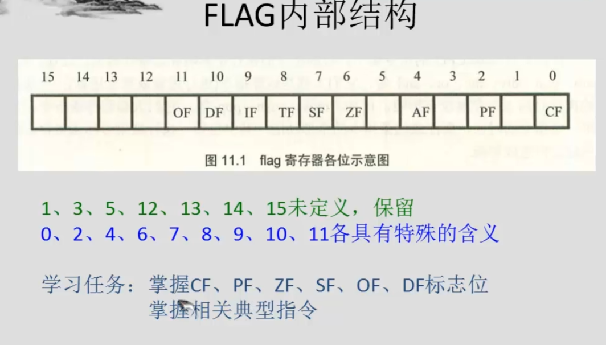
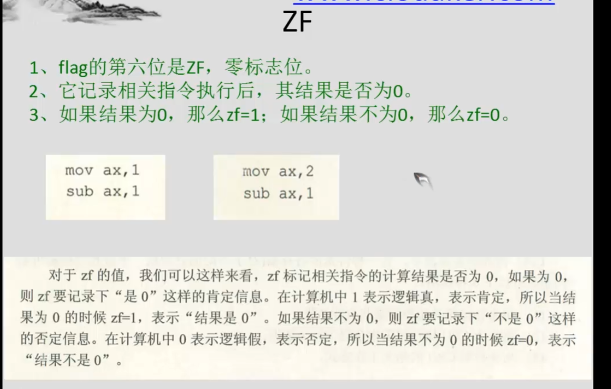

https://www.bilibili.com/video/BV1CJ411D7yD/?spm_id_from=333.337.search-card.all.click&vd_source=2e667108a79dbd7c0e41585781e009bf

# 1 基础
## 1.1 机器语言

## 1.2 汇编

## 1.3 CPU,寄存器,内存

## 1.4 总线
inter8086

# 2 寄存器

通用寄存器
段寄存器CS与IP

