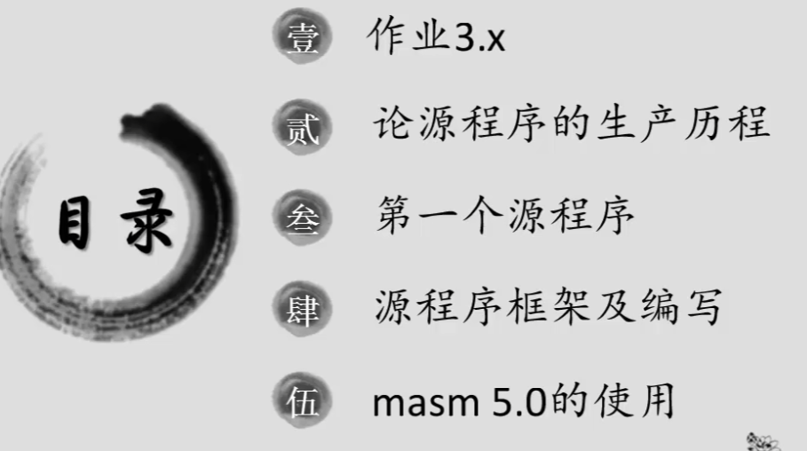
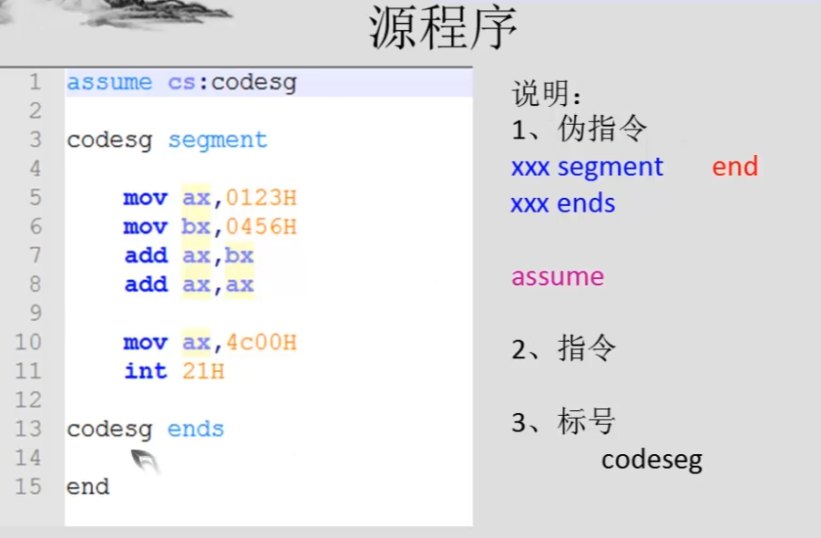
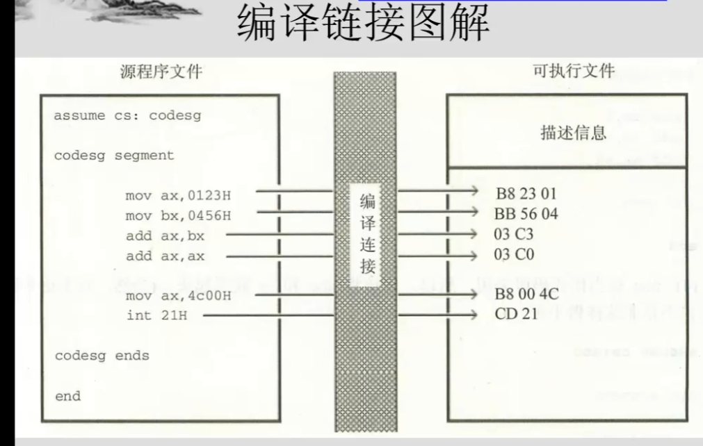
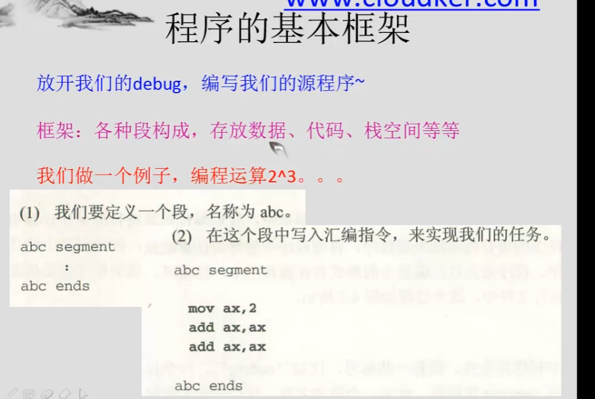
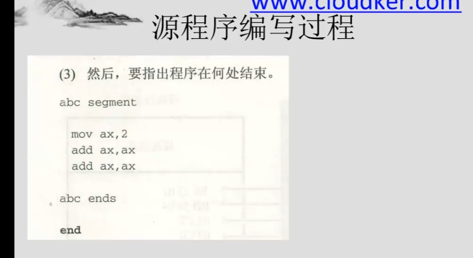
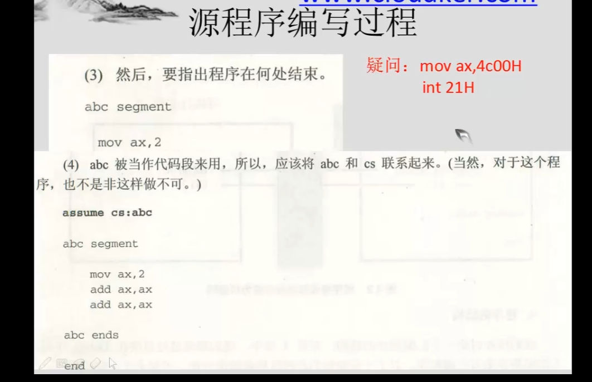
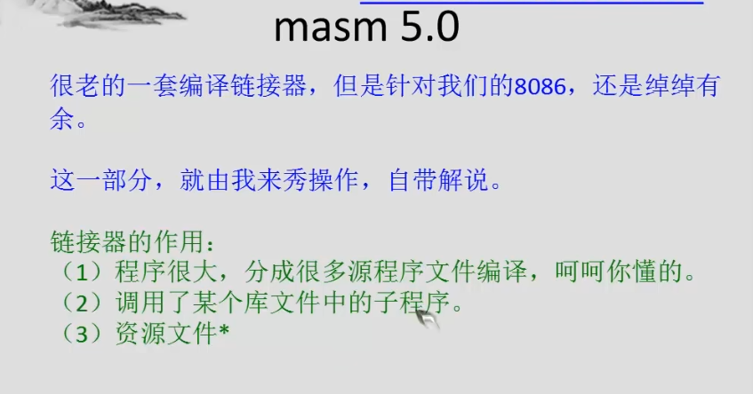
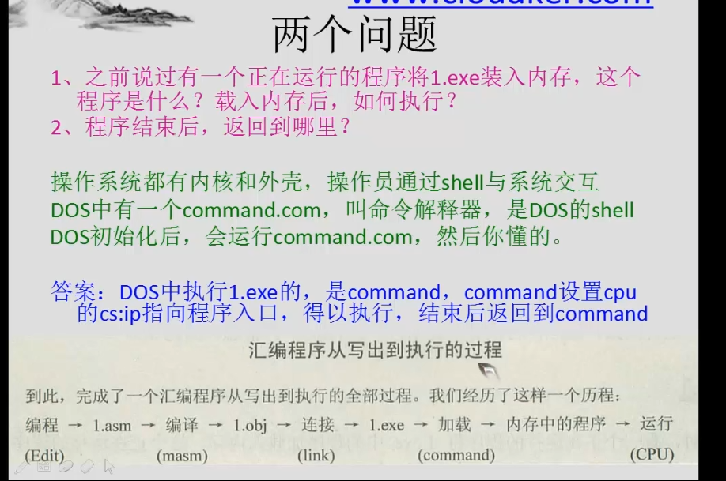
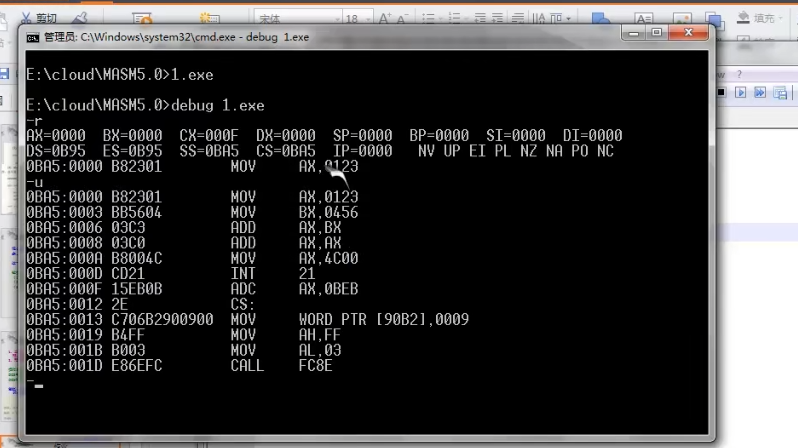
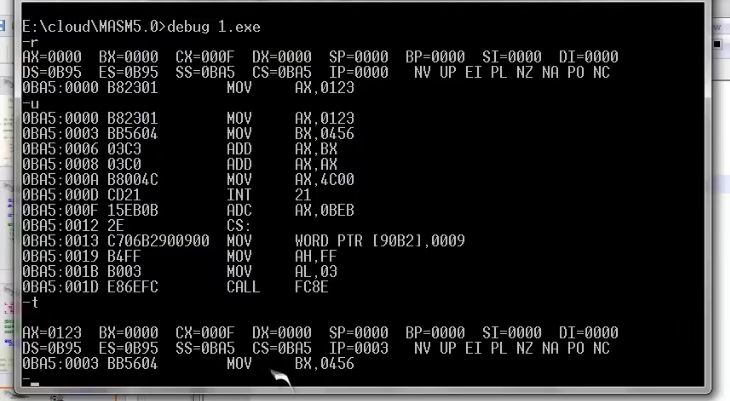

```asm
assume cs:codesg
codesg segment
    mov ax, 0123h
    mov bx, 0456h
    add ax, bx
    add ax, ax
    
    mov ax, 4c00H
    int 21h

codesg ends

end
```

C:\Users\wangly\Downloads\MASM 6.x>MASM.EXE 1.asm
C:\Users\wangly\Downloads\MASM 6.x>LINK.EXE 1.obj



debug


-t 执行一步
-p 结束

