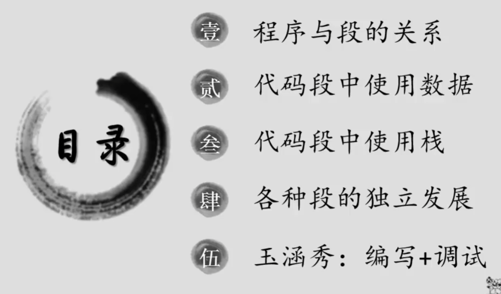
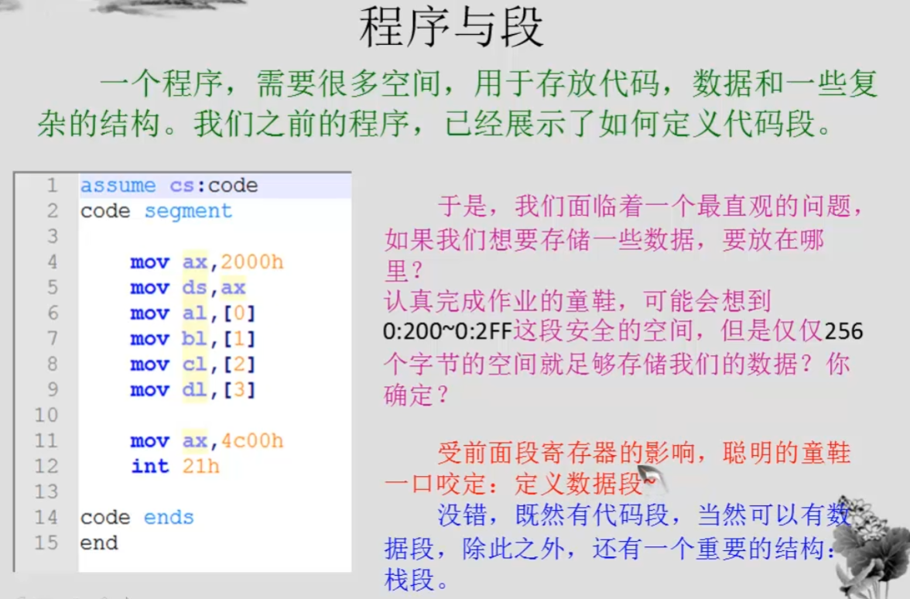
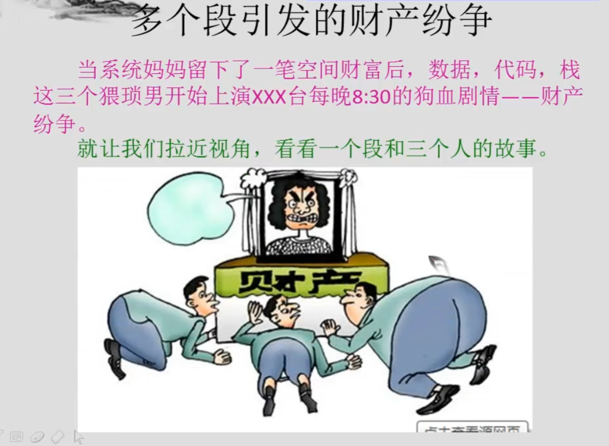
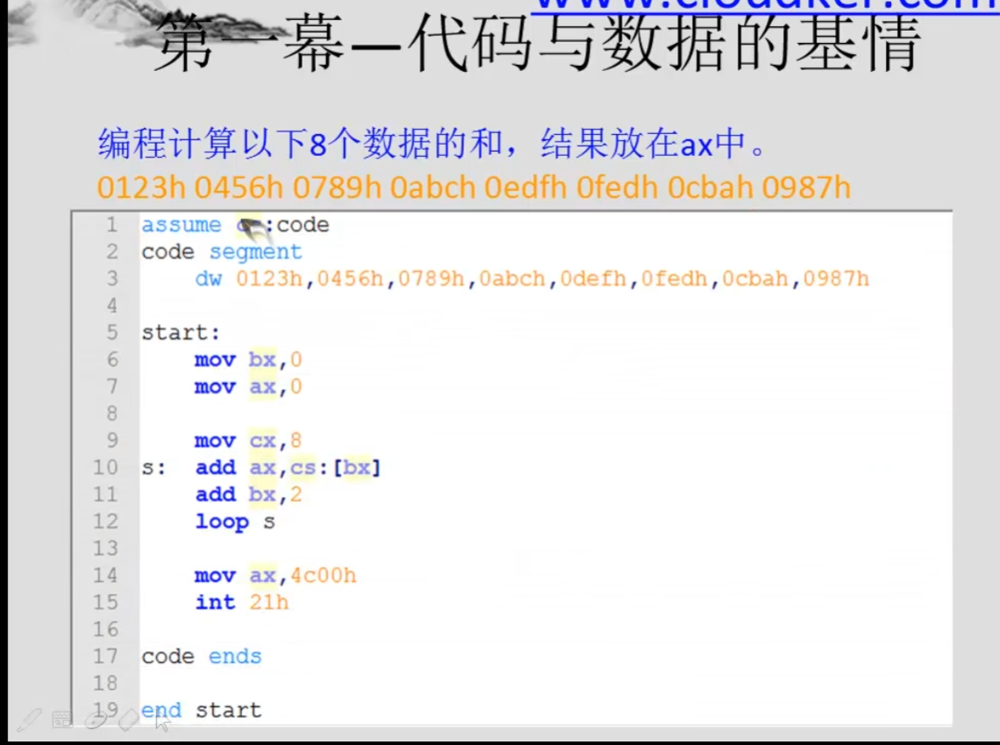
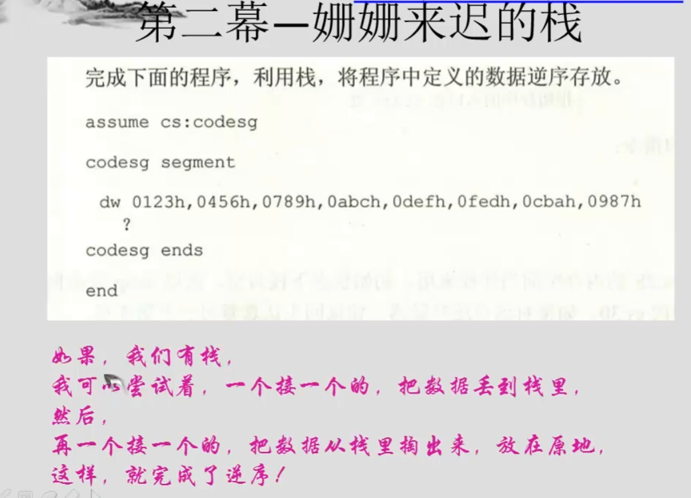
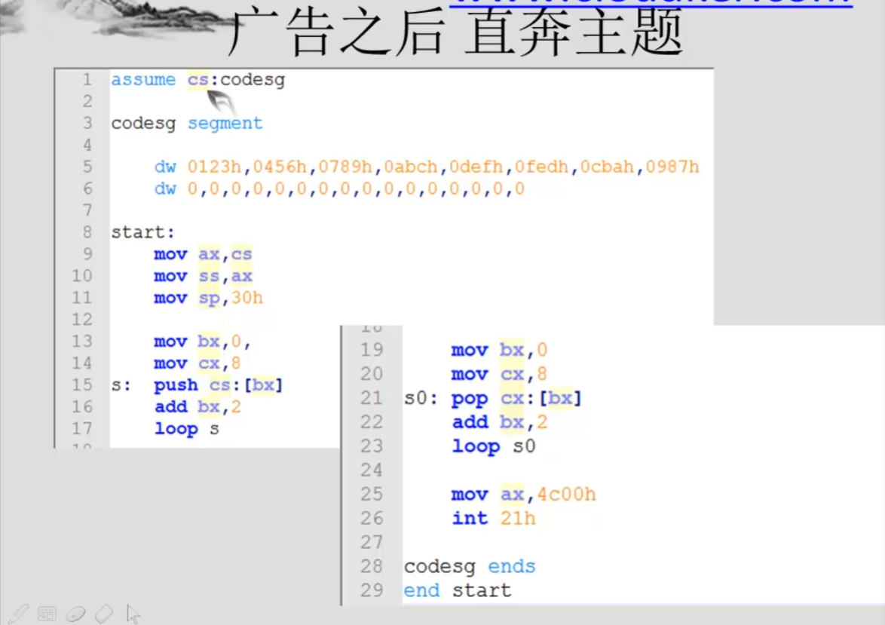
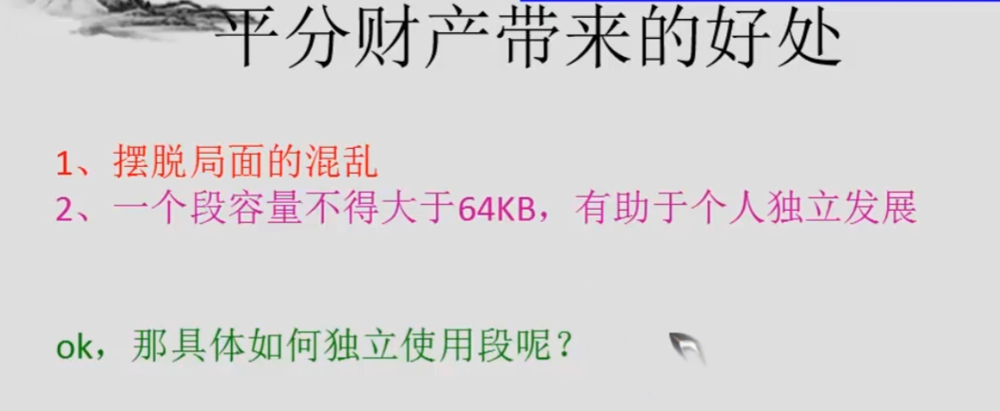

dw 定义word两个字节
start 表示从当前行开始执行

如果不加start指令就会从第一行执行，定义的一些数据就会被当成代码执行，会出翔问题








```asm
assume cs:codesg
codesg segment//代码段
    dw 0123h, 0456h, 0789h, 0abch, 0defh, 0fedfh, 0cbah, 0987h
    dw 0,0,0,0,0,0,0,0,0,0,0,0,0,0,0,0
start:
    add ax, cs
    add ss, ax
    mov sp,30h

    mov bx,0
    mov cx,8
s:  push cs:[bx]
    add bx,2
    loop s
    
    mov bx,0
    mov cx,8
s1: pop cx:[bx]
    add bx,2
    loop s1
    
    mov ax,4c00h
    int 21h
codesg ends
end start

```
使用多个段
代码段，数据段，栈段
```asm
assume cs:codesg ds:datasg ss:stacksg
datasg segment//数据段
    dw 0123h, 0456h, 0789h, 0abch, 0defh, 0fedfh, 0cbah, 0987h
datasg ends
stacksg segment//栈段
    dw 0,0,0,0,0,0,0,0,0,0,0,0,0,0,0,0
stacksg ends
codesg segment//代码段
start:
    add ax, stacksg
    add ss, ax
    mov sp,20h

    mov ax,datsg
    mov ds,ax
    
    mov bx,0
    mov cx,8
s:  push ds:[bx]
    add bx,2
    loop s
    
    mov bx,0
    mov cx,8
s1: pop ds:[bx]
    add bx,2
    loop s1
    
    mov ax,4c00h
    int 21h
codesg ends
end start

```


