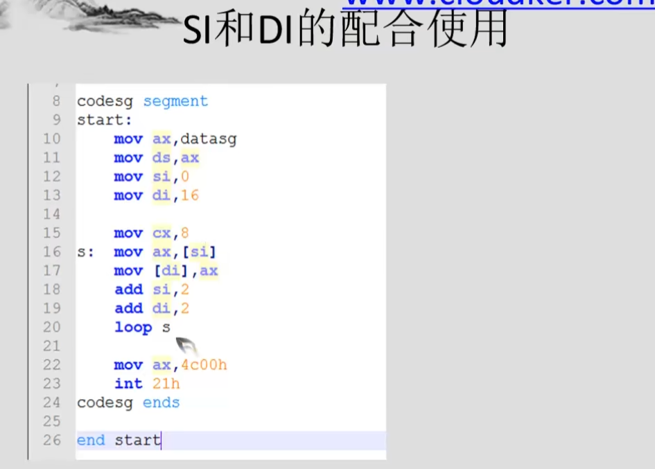

dw定义字  
db定义字符串    底层是存储ascii  


```asm
assume cs:codesg,ds:datasg
datasg segment
    db 'Basic'
    db 'iNfor'
datasg ends

codesg segment
start:
    mov ax,datasg
    mov ds,ax
    mov bx,0
    mov cx,5

s:
    mov al,[bx]
    and al,11011111B
    mov [bx],al
    inc bx
    loop s

    mov bx,5
    mov cx,11
s0: mov al,[bx]
    or al,00100000B
    mov [bx],al
    inc bx
    loop s0
    
    mov ax,4c00h
    int 21h
codesg ends
end start
codesg ends
end start

```



```asm
assume cs:codesg,ds:datasg
datasg segment
    db 'welcome to cloud'
    db '................'
datasg ends
codesg segment
start
    mov ax,datasg
    mov ds,ax
    mov si,0
    mov di,16
    
    mov cx,8
s:  mov ax,[si]
    mov [di],ax
    add si,2
    add di,2
    loop s

    mov ax,4c00h
    int 21h
codesg ends
end start
```


