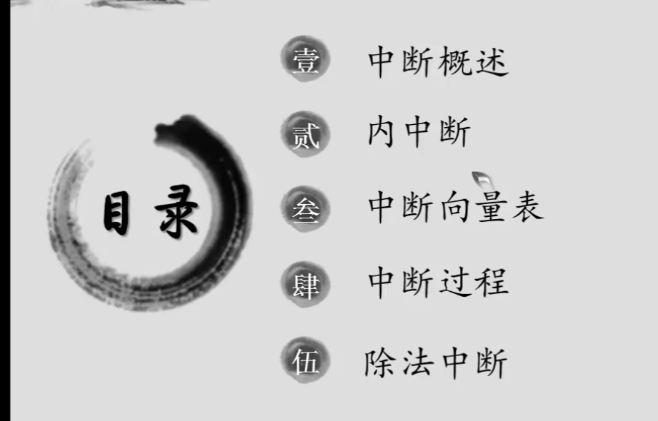

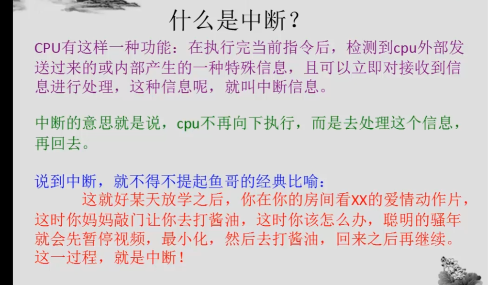

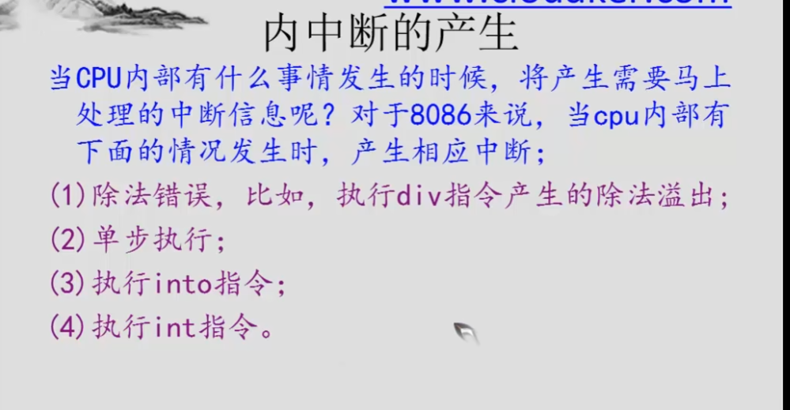

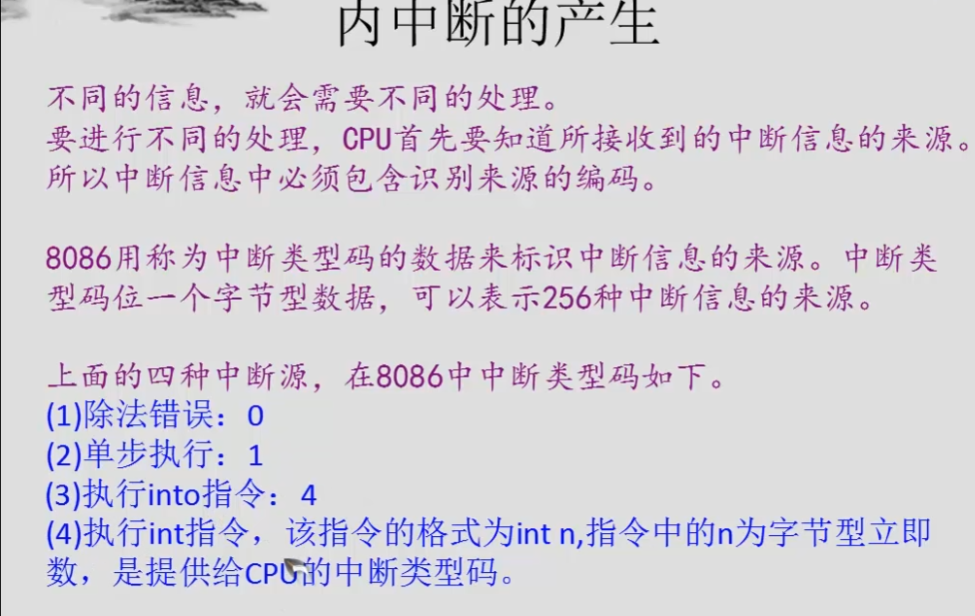

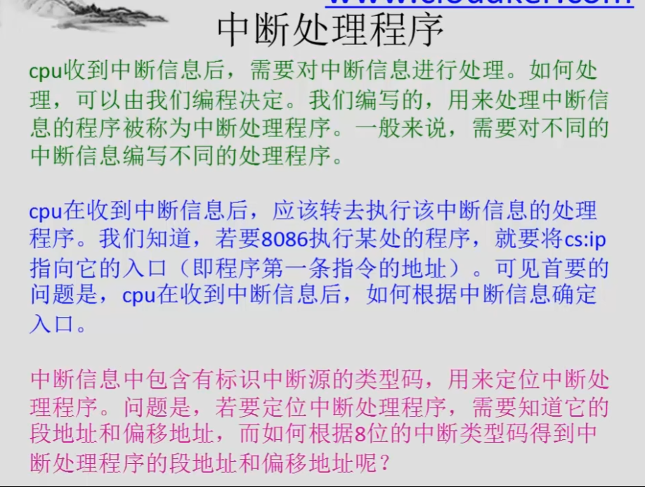
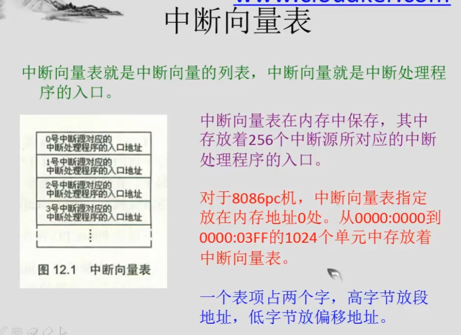

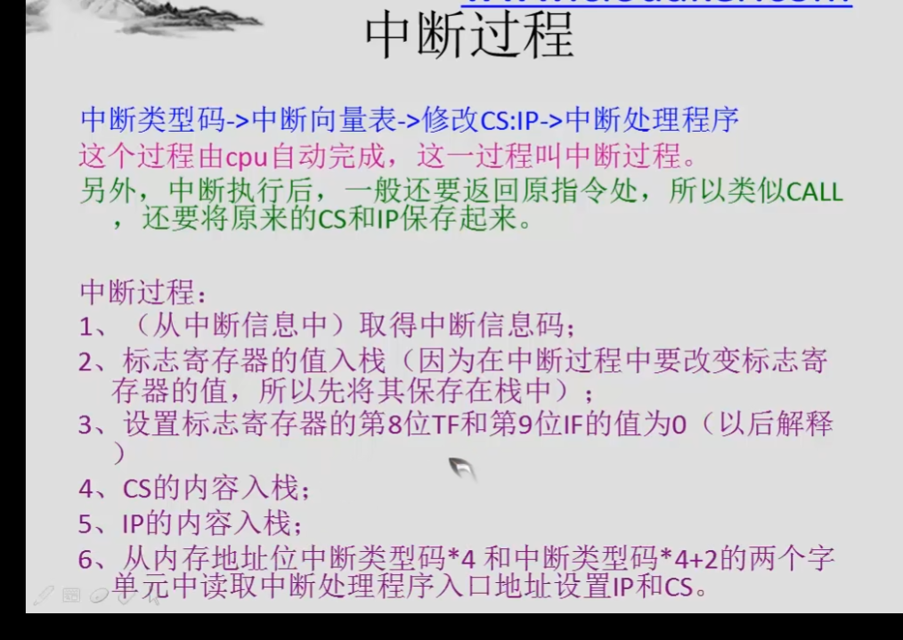

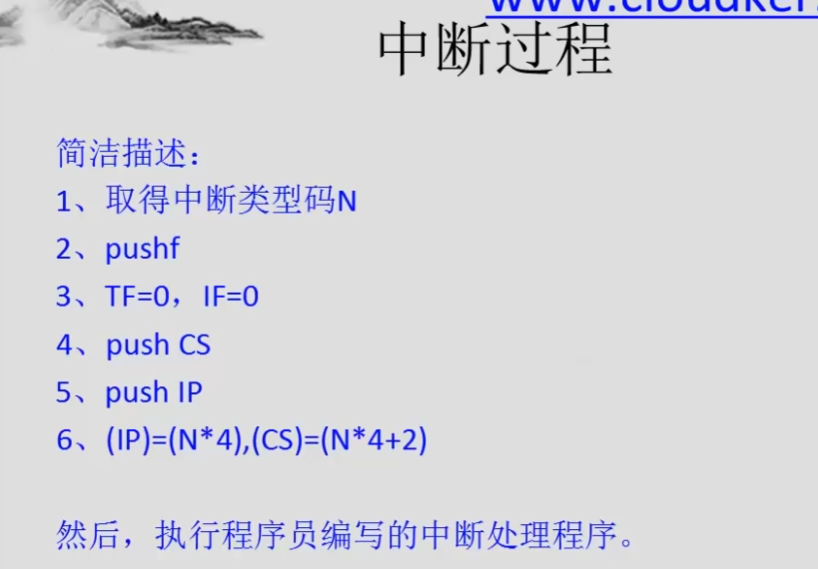

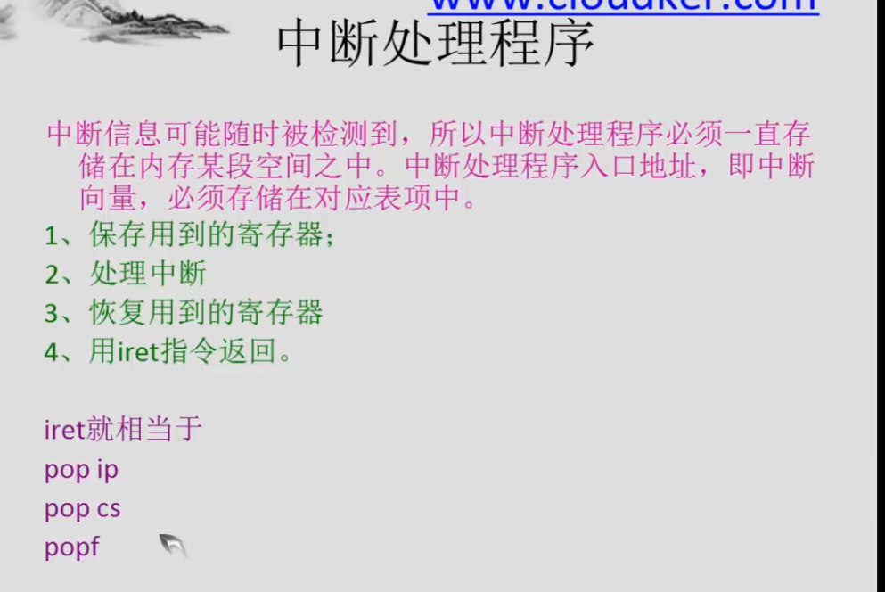
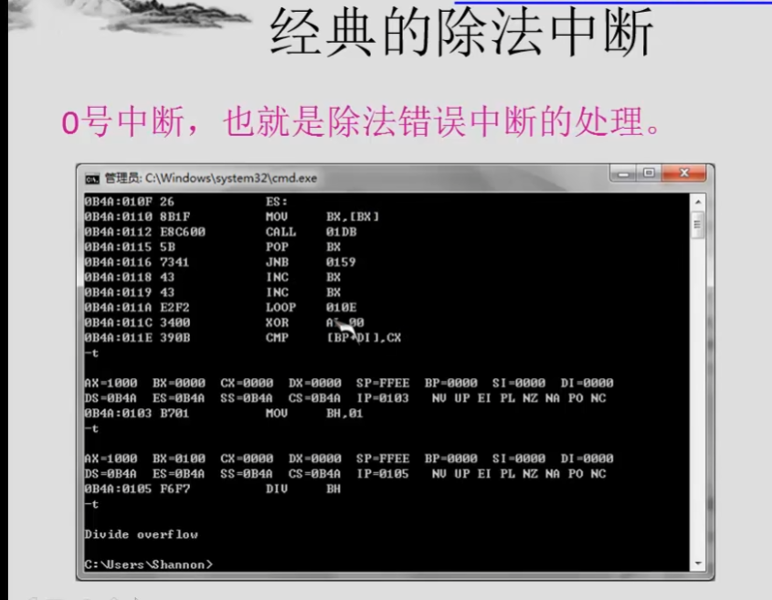


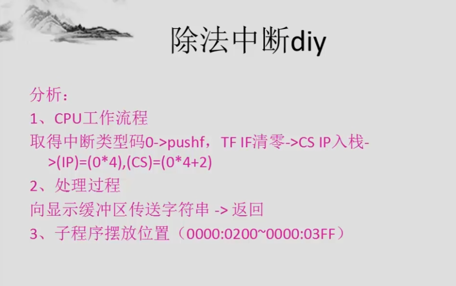


```asm
assume cs:code

code segment
start:
    mov ax,cs
    mov ds,ax
    mov si,offset do0 ;ds:si指向源地址
    
    mov ax,0
    mov es,ax
    mov di,200h ;es:di指向目的地址
    
    mov cx,offset do0end-offset do0 ;cx表示源地址中数据的长度
    cld ;cx表示源地址中数据的长度
    rep movsb ;cx表示源地址中数据的长度
    
    mov ax,0
    mov es,ax
    mov word ptr es:[0*4],200h ;es:[0*4]表示0000:0000h
    mov word ptr es:[0*4+2],0 ;es:[0*4+2]表示0000:0002
    
    mov ax,4c00h
    int 21
    
do0:
    jmp short do0start
    db "overflow!"
    
do0start:
    mov ax,cs
    mov ds,ax
    mov si,202h
    
    mov ax,0b800h
    mov es,ax
    mov di,12*160+30*2 ;es:di指向屏幕第12行，第30列处
    
    mov cx,9
s:  mov al,[si]
    mov es:[di],al
    inc si
    add di,2
    loop s

do0end:
    nop
    
    
code ends
end start
```


