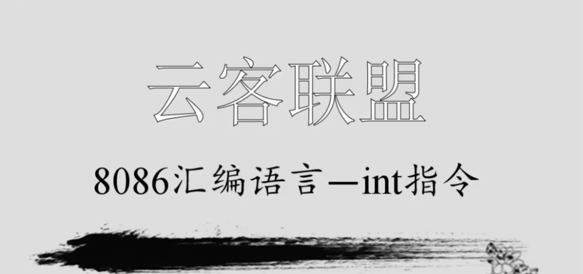
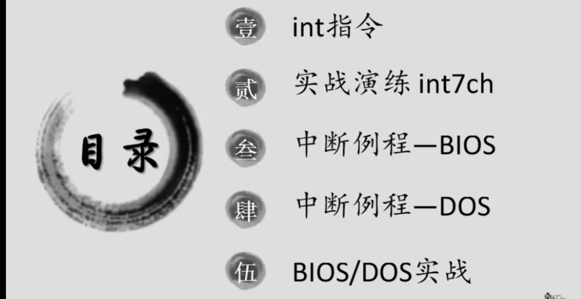

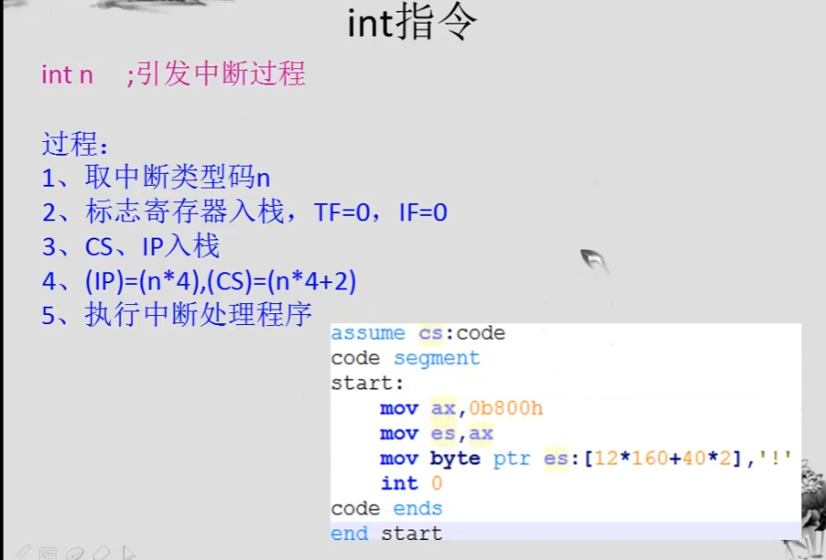

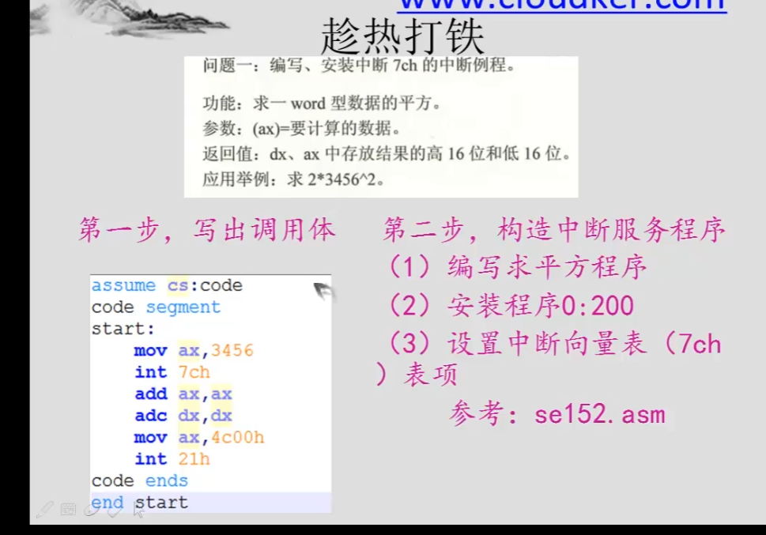


```asm
assume cs:code

code segment
start:
    mov ax,cs
    mov ds,ax
    mov si,offset sqr ;ds:si指向源地址
    
    mov ax,0
    mov es,ax
    mov di,200h ;es:di指向目的地址
    mov cx,offset sqrend-offset sqr ;cx表示源地址中数据的长度
    cld ;cx表示源地址中数据的长度
    rep movsb ;cx表示源地址中数据的长度
    
    mov ax,0
    mov es,ax
    mov word ptr es:[7ch*4],200h ;es:[0*4]表示0000:0000h
    mov word ptr es:[7ch*4+2],0 ;es:[0*4+2]表示0000:0002
    
    mov ax,4c00h
    int 7ch
    
    add ax,ax
    adc dx,dx
    
    mov ax,4c00h
    int 21h
    
sqr:
    mul ax
    iret
sqrend:nop
code ends
end start
```
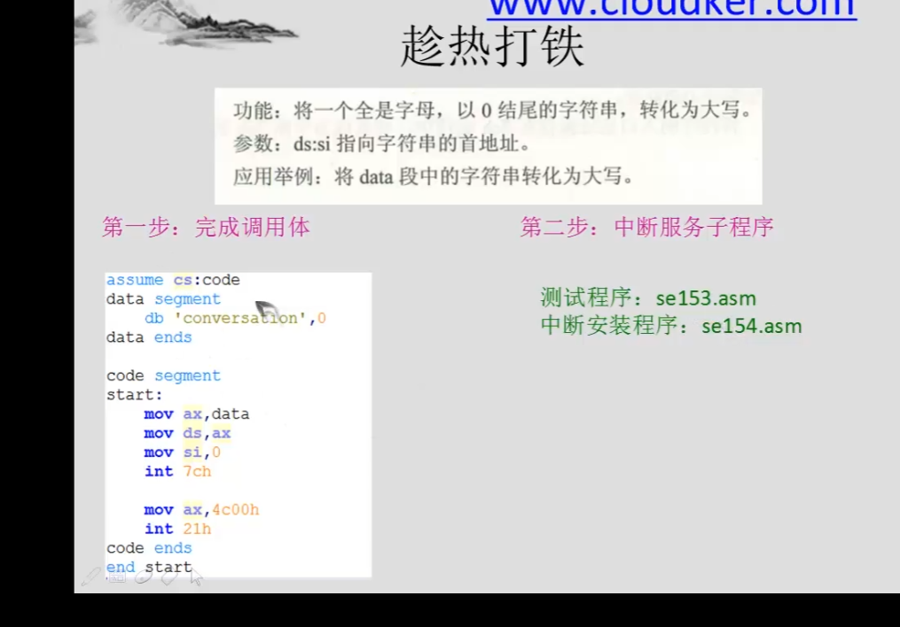


```asm
assume cs:code

code segment
start:
    mov ax,cs
    mov ds,ax
    mov si,offset capital ;ds:si指向源地址
    
    mov ax,0
    mov es,ax
    mov di,200h ;es:di指向目的地址
    mov cx,offset capitalend-offset capital ;cx表示源地址中数据的长度
    cld ;cx表示源地址中数据的长度
    rep movsb ;cx表示源地址中数据的长度
    
    mov ax,0
    mov es,ax
    mov word ptr es:[7ch*4],200h ;es:[0*4]表示0000:0000h
    mov word ptr es:[7ch*4+2],0 ;es:[0*4+2]表示0000:0002

    mov ax,4c00h
    int 21h
    
capital:
    push cx
    push si

change:
    mov cl:[si]
    mov ch,0
    jcxz ok
    and byte ptr [si],11011111b
    inc si
    jmp short  change

ok:
    pop si
    pop cx
    iret
capitalend:
    nop

sqrend:nop
code ends
end start
```
```asm
assume cs:code
data segment
    db 'hello world',0
data ends
code segment
start:
    mov ax,data
    mov ds,ax
    mov si,0
    int 7ch
    
    mov ax,4c00h
    int 21h
code ends
end start
```
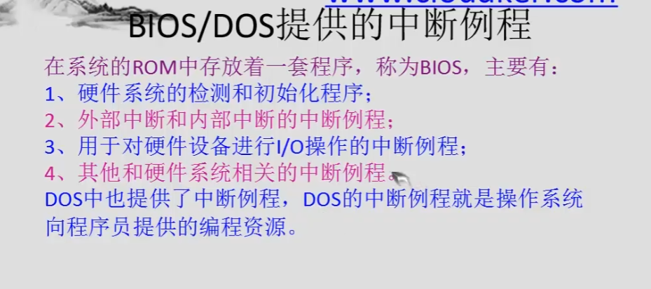
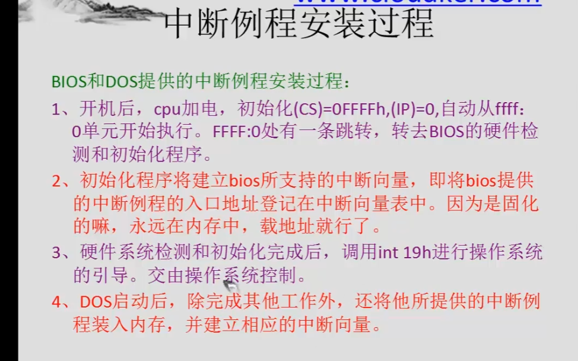
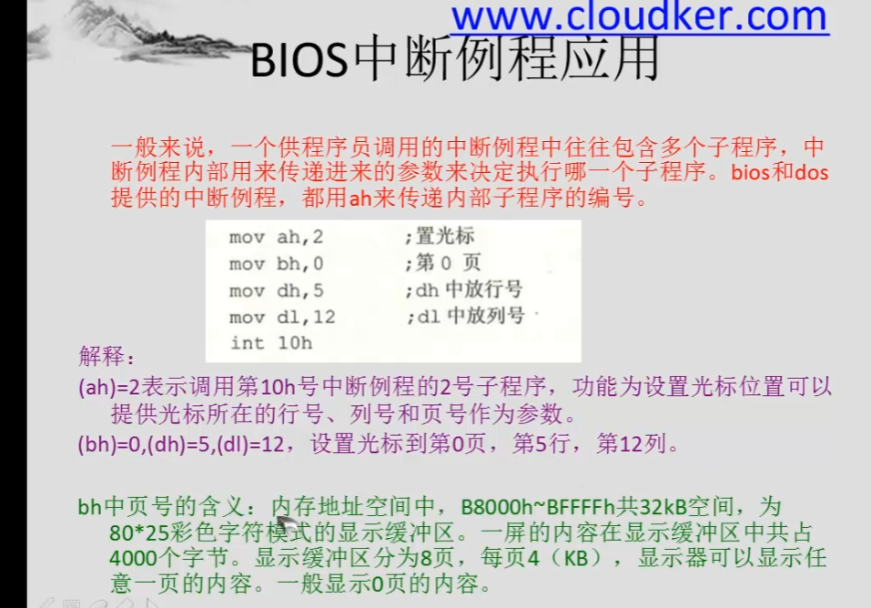

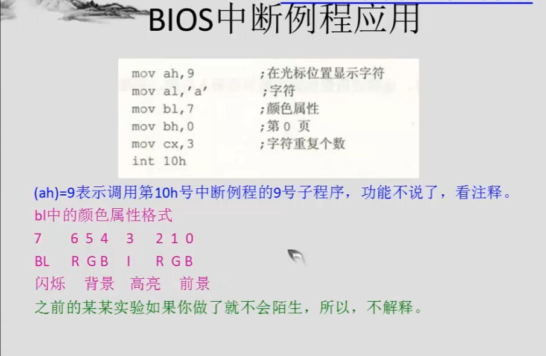

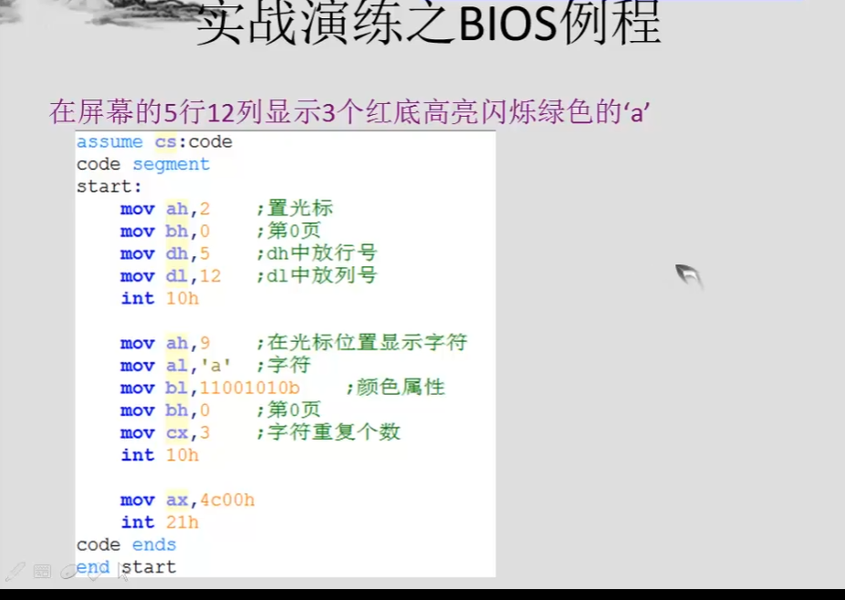

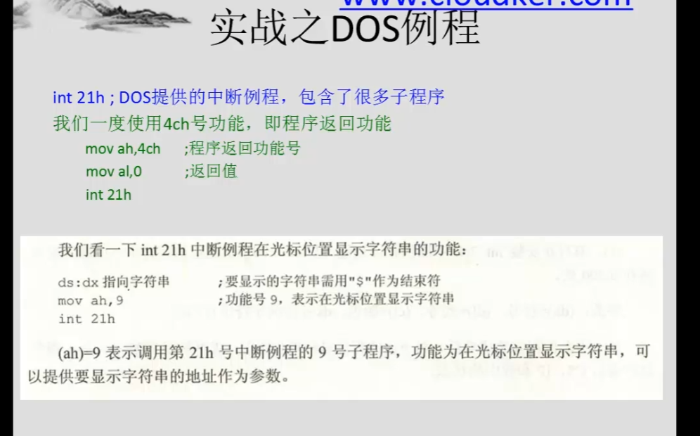

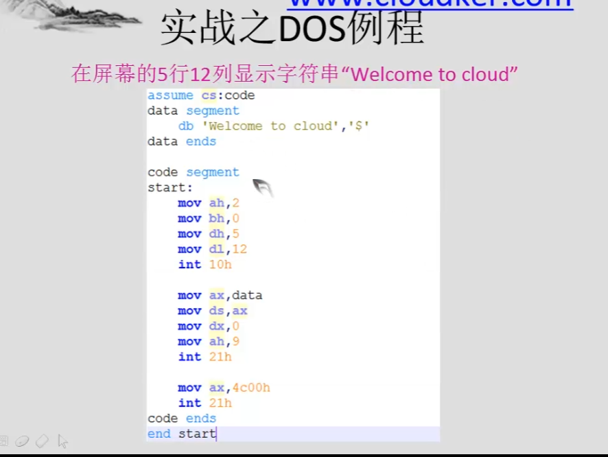


