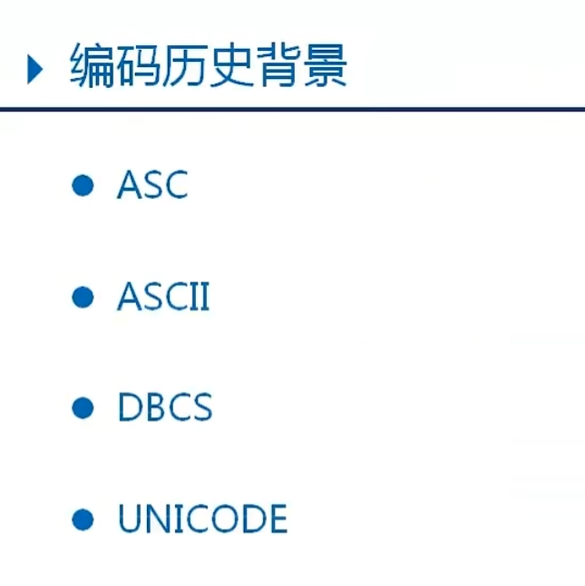
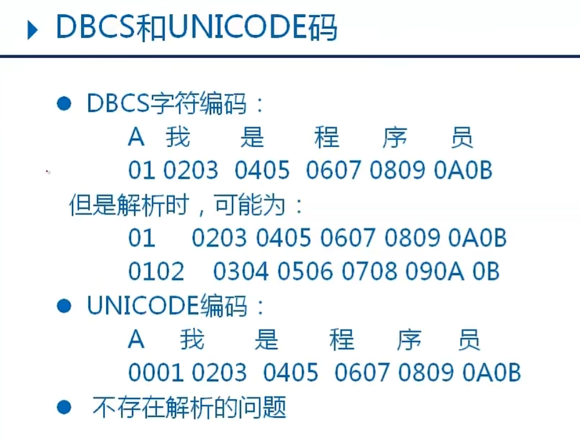
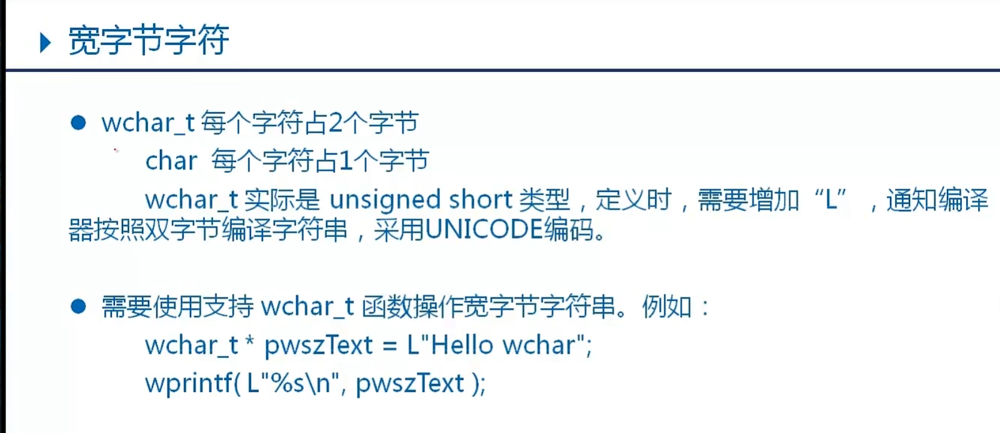
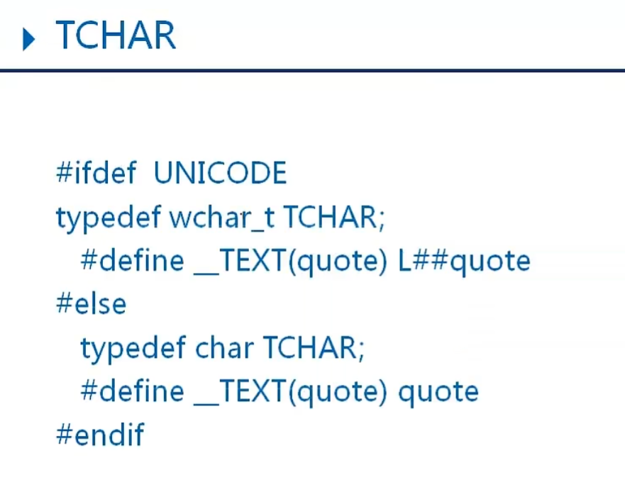
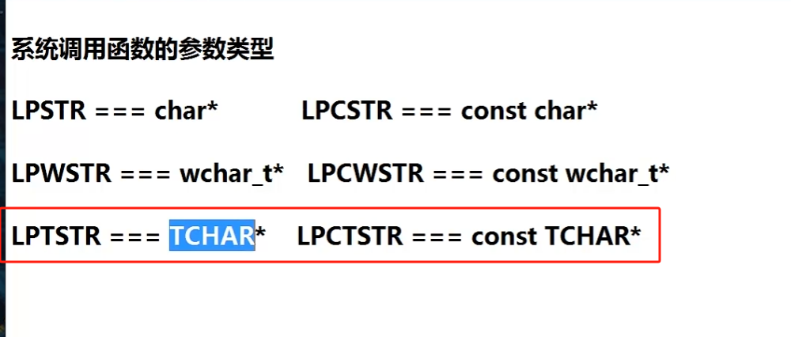

DBCS单双字节混合编码

windows系统调用大量使用
LPTSTR===TCHAR*
LPCTSTR===const TCHAR*

TCHAR*
如果你的程序中又 Unicode 宏定义，那么 TCHAR 就是宽字符类型，否则就是窄字符类型。
那你在书写 代码的时候，字符串必须要多加一个 L
L"你好，世界";

如果你的项目字符集在编译器设置了 unicode 字符集，有的编译器会默认给你加一个 unicode 宏

