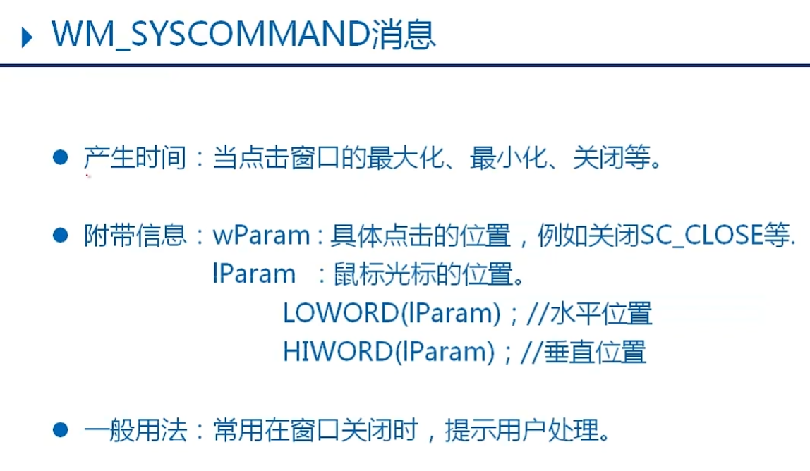
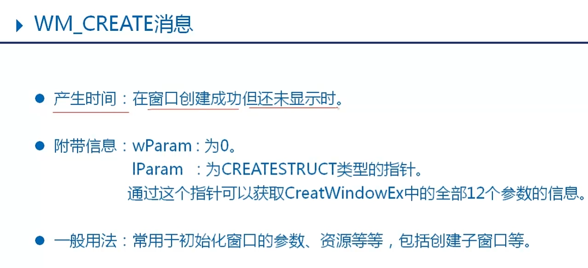
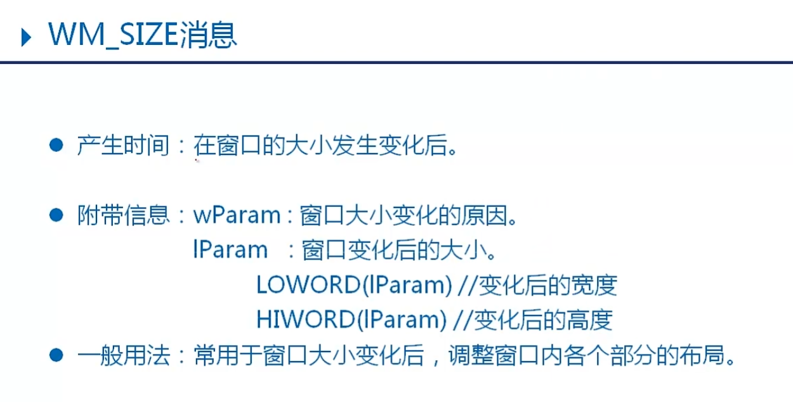
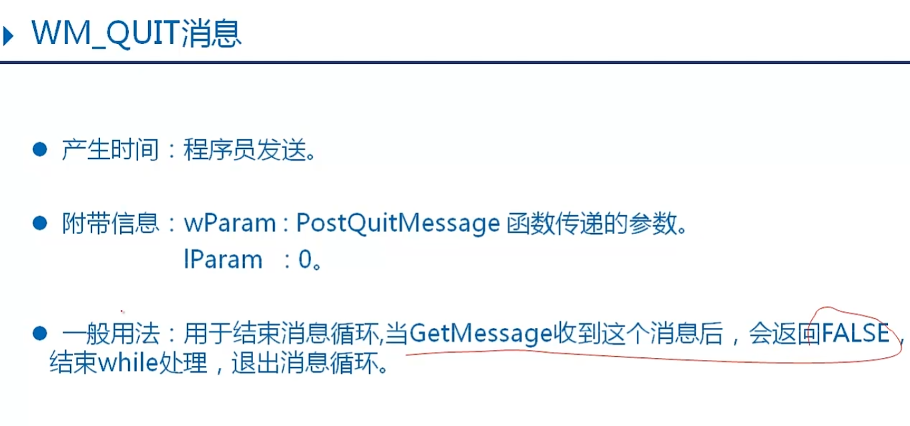

消息发送给窗口的窗口处理函数


消息种类











消息循环
消息循环的阻塞
GetMessage 
 - 从系统获取消息，将消息从系统中移除，阻塞函数。当系统无消息时，会等候下一条消息。

PeekMessage 
 - 以查看的方式从系统获取消息，可以不将消息从系统移除，非阻塞函数。当系统无消息时，返回FALSE，继续执行后续代码。
```c
BOOL PeekMessage(
LPMSG lpMsg,         // message information
HWND hWnd,           // handle to window
UINT wMsgFilterMin,  // first message
UINT wMsgFilterMax,  // last message
UINT wRemoveMsg //移除标识  
PM_REMOVE / PM_NOREMOVE
);
```

发送消息
SendMessage 
 - 发送消息，会等候消息处理的结果。

 - PostMessage 
- 投递消息，消息发出后立刻返回，不等候消息执行结果。

`window造消息都是这俩`
```c
BOOL SendMessage/PostMessage(
   HWND hWnd,//消息发送的目的窗口
   UINT Msg, //消息ID
   WPARAM wParam, //消息参数
   LPARAM lParam  //消息参数
);
```

消息分类
发送消息
系统消息 
 - ID范围 0 - 0x03FF(1024)  
   由系统定义好的消息，可以在程序中直接使用。

用户自定义消息 
 - ID范围 0x0400 - 0x7FFF(31743)  
   由用户自己定义，满足用户自己的需求。由用户自己发出消息，并响应处理。

    自定义消息宏：WM_USER 


