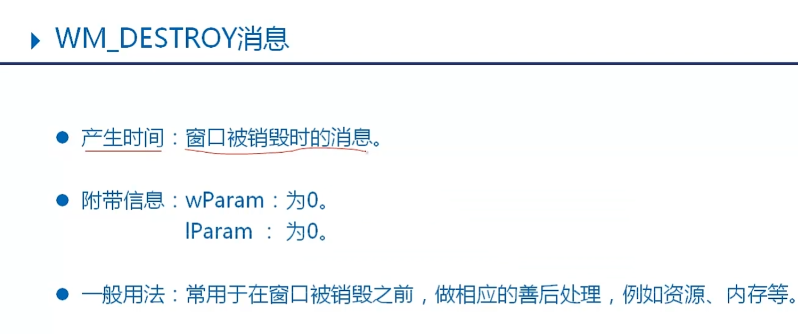

消息发送给窗口的窗口处理函数


消息种类




消息循环
消息循环的阻塞
GetMessage

- 从系统获取消息，将消息从系统中移除，阻塞函数。当系统无消息时，会等候下一条消息。

PeekMessage

- 以查看的方式从系统获取消息，可以不将消息从系统移除，非阻塞函数。当系统无消息时，返回FALSE，继续执行后续代码。

```c
BOOL PeekMessage(
LPMSG lpMsg,         // message information
HWND hWnd,           // handle to window
UINT wMsgFilterMin,  // first message
UINT wMsgFilterMax,  // last message
UINT wRemoveMsg //移除标识  
PM_REMOVE / PM_NOREMOVE
);
```

发送消息
SendMessage

- 发送消息，会等候消息处理的结果。

- PostMessage
- 投递消息，消息发出后立刻返回，不等候消息执行结果。

`window造消息都是这俩`

```c
BOOL SendMessage/PostMessage(
   HWND hWnd,//消息发送的目的窗口
   UINT Msg, //消息ID
   WPARAM wParam, //消息参数
   LPARAM lParam  //消息参数
);
```

消息分类
发送消息
系统消息

- ID范围 0 - 0x03FF(1024)  
  由系统定义好的消息，可以在程序中直接使用。

用户自定义消息

- ID范围 0x0400 - 0x7FFF(31743)  
  由用户自己定义，满足用户自己的需求。由用户自己发出消息，并响应处理。

  自定义消息宏：WM_USER

# 消息队列的概念

- 消息队列是用于存放消息的队列。
- 消息在队列中先入先出。
- 所有窗口程序都具有消息队列。
- 程序可以从队列中获取消息。

# 消息队列的分类

- 系统消息队列-由系统维护的消息队列。存放系统产生的消息，例如鼠标、键盘等。

- 程序消息队列-属于每一个应用程序（线程）的消息队列。由应用程序（线程）维护。

GetMessage只能在自己进程中抓消息
系统根据进程发送不同进程中消息,根据句柄确认哪个进程

# 消息和消息队列的关系

`消息和消息队列的关系`

- 1 当鼠标、键盘产生消息时，会将消息存放到系统消息队列
- 2 系统会根据存放的消息，找到对应程序的消息队列。
- 3 将消息投递到程序的消息队列中。

`根据消息和消息队列之间使用关系，将消息分成两类：`

- 队列消息 - 消息的发送和获取，都是通过消息队列完成。
- 非队列消息 - 消息的发送和获取，是直接调用消息的窗口处理完成。

`队列消息-消息发送后，首先放入队列，然后通过消息循环，从队列当中获取。`

- GetMessage - 从消息队列中获取消息
- PostMessage - 将消息投递到消息队列
- 常见队列消息：WM_PAINT、键盘、鼠标、定时器。

`非队列消息－消息发送时，首先查找消息接收窗口的窗口处理函数，直接调用处理函数，完成消息。`

- SendMessage - 直接将消息发送给窗口的处理函数，并等候处理结果。
- 常见消息：WM_CREATE、WM_SIZE等。

# 深谈GetMessage

- 在程序（线程）消息队列查找消息，如果队列有消息，检查消息是否满足指定条件(HWND,ID范围)，不满足条件就不会取出消息，否则从队列取出消息返回。
- 如果程序（线程）消息队列没有消息，向系统消息队列获取属于本程序的消息。如果系统队列的当前消息属于本程序，系统会将消息转发到程序消息队列中。
- 如果系统消息队列也没有消息，检查当前进程的所有窗口的需要重新绘制的区域，如果发现有需要绘制的区域，产生WM_PAINT消息，取得消息返回处理。
- 如果没有重新绘制区域，检查定时器如果有到时的定时器，产生WM_TIMER,返回处理执行。
- 如果没有到时的定时器，整理程序的资源、内存等等。
- GetMessage会继续等候下一条消息。PeekMessage会返回FALSE，交出程序的控制权。
- 注意：GetMessage如果获取到是WM_QUIT,函数会返回FALSE。

`WM_PAINT消息`

- 产生时间：当窗口需要绘制的时候。
- 附带信息：wParam : 0。
  lParam : 0。
- 专职用法：用于绘图。
- 窗口无效区域 ：需要重新绘制的区域。

```c
BOOL InvalidateRect(
  HWND hWnd,  //窗口句柄
  CONST RECT* lpRect,  //区域的矩形坐标
  BOOL bErase  //重绘前是否先擦除
  );
```

- 消息处理步骤
  1> 开始绘图

```c
HDC BeginPaint(
HWND hwnd, //绘图窗口
LPPAINTSTRUCT lpPaint //绘图参数的BUFF
); 返回绘图设备句柄HDC
```

2> 正式绘图
3> 结束绘图

```c
BOOL EndPaint(
HWND hWnd, //绘图窗口
CONST PAINTSTRUCT *lpPaint  //绘图参数的指针BeginPaint返回
);
```

# 键盘消息

## 键盘消息分类

- WM_KEYDOWN - 按键被按下时产生
- WM_KEYUP - 按键被放开时产生
- WM_SYSKEYDOWN - 系统键按下时产生 比如ALT、F10
- WM_SYSKEYUP - 系统键放开时产生

- 附带信息：
  WPARAM - 按键的Virtual Key
  LPARAM - 按键的参数，例如按下次数

## 字符消息（WM_CHAR）

- TranslateMessage在转换WM_KEYDOWN消息时，对于可见字符可以产生WM_CHAR,不可见字符无此消息。


- 附带信息：
    - WPARAM - 输入的字符的ASCII字符编码值
    - LPARAM - 按键的相关参数

# 鼠标消息分类

- 基本鼠标消息
    - WM_LBUTTONDOWN - 鼠标左键按下
    - WM_LBUTTONUP - 鼠标左键抬起
    - WM_RBUTTONDOWN - 鼠标右键按下
    - WM_RBUTTONUP - 鼠标右键抬起
    - WM_MOUSEMOVE - 鼠标移动消息
- 双击消息
    - WM_LBUTTONDBLCLK - 鼠标左键双击
    - WM_RBUTTONDBLCLK - 鼠标右键双击
- 滚轮消息
    - WM_MOUSEWHEEL - 鼠标滚轮消息

## 鼠标基本消息

`附带信息：`

- wPARAM ： 其他按键的状态，例如Ctrl/Shift等
- lPARAM ： 鼠标的位置，窗口客户区坐标系。
    - LOWORD X坐标位置
    - HIWORD Y坐标位置

`一般情况鼠标按下/抬起成对出现。在鼠标移动过程中，会根据移动速度产生一系列的WM_MOUSEMOVE消息。`

## 鼠标双击消息

`附带信息：`

- wPARAM - 其他按键的状态，例如Ctrl/Shift等
- lPARAM - 鼠标的位置，窗口客户区坐标系。
- LOWORD(lParam)   //X坐标位置
- HIWORD(lParam)    //Y坐标位置

`消息产生顺序`
`以左键双击为例：`

- WM_LBUTTONDOWN
- WM_LBUTTONUP
- WM_LBUTTONDBLCLK
- WM_LBUTTONUP

`使用时需要在注册窗口类的时候添加CS_DBLCLKS 风格。`

## 鼠标滚轮消息

`附带信息：`

- wPARAM：
    - LOWORD - 其他按键的状态
    - HIWORD - 滚轮的偏移量，通过正负值表示表示滚动方向。
    - 正：向前滚动 负：向后滚动
- lPARAM：鼠标当前的位置，屏幕坐标系
    - LOWORD - X坐标
    - HIWORD - Y坐标

`使用：`

- 通过偏移量，获取滚动的方向和距离。

# 定时器消息
产生时间：
  在程序中创建定时器，当到达时间间隔时，定时器会向程序发送一个WM_TIMER消息。定时器的精度是毫秒，但是准确度很低。例如设置时间间隔为1000ms，但是会在非1000毫秒到达消息。

附带信息：
  wPARAM ： 定时器ID
  lPARAM ： 定时器处理函数的指针

## 创建和销毁定时器
创建定时器
```c
UINT_PTR SetTimer(
HWND hWnd,//定时器窗口句柄
UINT_PTR nIDEvent, //定时器ID
UINT uElapse,//时间间隔
TIMERPROC lpTimerFunc //定时器处理函数指针( 一般不使用,为NULL)
);创建成功，返回非0。
```
关闭定时器
```c
BOOL KillTimer(
HWND hWnd,//定时器窗口句柄
UINT_PTR uIDEvent //定时器ID
);
```


